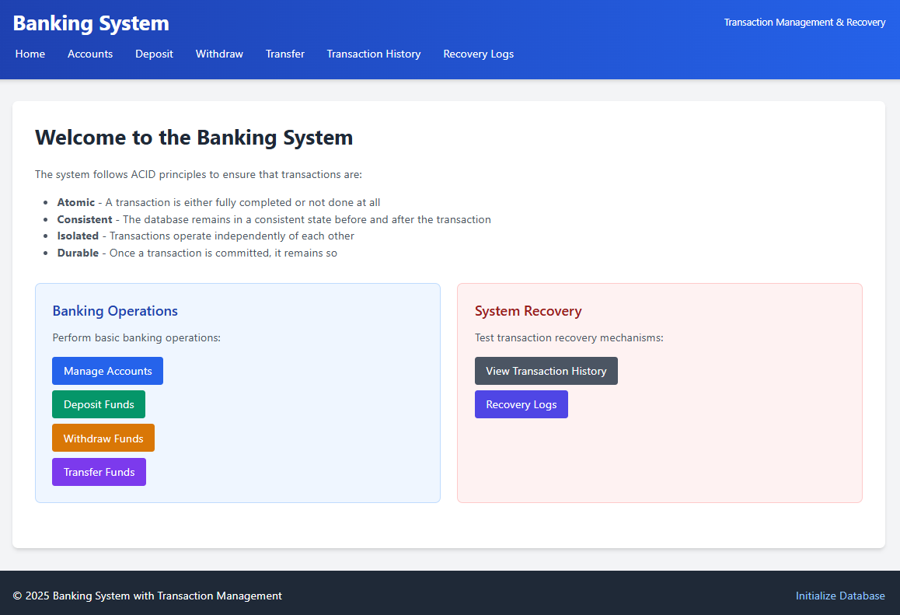

## 🏦 Simple Banking System with Transaction Management (Python Edition)

A command-line banking system developed in **Python** using **Object-Oriented Programming (OOP)** principles. This project replicates core banking functionalities such as account creation, deposit, withdrawal, and transaction tracking — inspired by the [React version](https://github.com/JV-Vigneesh/Simple-Banking-System-with-Transaction-Management-React-Edition).

---



---

⚠️⚠️Clean up Needs to be Done⚠️⚠️

### 📌 Features

* 🧾 Create, update, and delete customer accounts
* 💰 Deposit and withdraw money
* 🔄 Record and track transactions
* 📈 Check account balance
* 🔒 Basic authentication (if applicable)
* 🧱 Built using clean OOP design (e.g., classes for Bank, Account, Transaction)

---

### 🛠️ Technologies Used

* **Python 3.x**
* **OOP Concepts** (Classes, Inheritance, Encapsulation)
* **JSON / File I/O / SQLite** (optional for data persistence)

---

### 🚀 Getting Started

#### Clone the repository

```bash
git clone https://github.com/JV-Vigneesh/simple-banking-python.git
cd simple-banking-python
```

#### Run the app

```bash
python main.py
```

---

### 📸 Demo (Optional)

*Screenshots or terminal GIFs can go here to show how it works.*

---

### ✅ Future Improvements

* Add a graphical interface using **Tkinter** or a web interface using **Flask**
* Implement **database support** (e.g., SQLite)
* Add **unit testing** with `unittest` or `pytest`
* Enhance security (e.g., password hashing)

---

### 🙌 Acknowledgments

Based on the [React edition](https://github.com/JV-Vigneesh/Simple-Banking-System-with-Transaction-Management-React-Edition). Recreated in Python for deeper backend logic understanding and flexibility.

---

### 📃 License

MIT License © 2025
